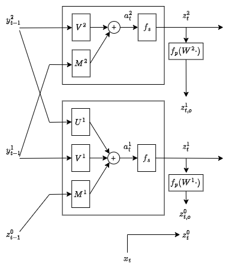

# Notes on P-TNCN

P-TNCN can be thought of as having three phases: update, predict, correct. We study the basic model with two "hidden layers" implemented in the "Continual Learning of Recurrent Neural Networks by Locally Aligning Distributed Representations" paper.

The below definitions/notation follow the paper for the most part, and they omit biases and use column-major convention. The implementation, as is standard, uses row-major.

One big idea is to replace the single global loss function (from which we backpropagate error gradients to the rest of the network) with multiple *local* loss functions, one loss function per layer, and then that local loss to make local adjustments. TODO: explain all of that in more detail

All notation below uses superscripts $X^{\ell}$ for layers $\ell = 0, 1, 2$.

## Update

We have layers of neurons $z_t^0, z_t^1, z_t^2$ that maintain state. $z_t^0$ is clamped to the input $x_t$ at each time $t$. The other layers are calculated as:

$$a_t^2 := V^2 y_{t-1}^2 + M^2 y_{t-1}^1$$

$$z_t^2 := f_s(a_t^2)$$

$$a_t^1 := U^1 y_{t-1}^2 + V^1 y_{t-1}^1 + M^1 z_{t-1}^0$$

$$z_t^1 := f_s(a_t^1)$$

$$z_t^0 := x_t$$

where:

 - $f_s$ is the component-wise state update activation function, which we assume is the same across all neurons in all layers for the sake of simple notation. You can imagine generalizations where different layers or different units in the same layer use different activation functions.
 - each $y_{t-1}^k$ is thought of as the *corrected* version of $z_{t-1}^k$. See the correction phase below.
 - the $V^k$, $W^k$, $M^k$ values are all weight matrices that are updated during the correction phase.

## Predict

Each of the non-input layers, having updated, makes a top-down prediction of the layer below:

$$z_{t,o}^1 := f_p(W^2 z_t^2)$$

$$z_{t,o}^0 := f_p(W^1 z_t^1)$$

where $f_p$ is the prediction function, which may be component-wise, but might also be softmax or (or some other non-component-wise function), and the $W^k$'s are weight matrices.

## Correct

P-TNCN also has error units at each of the lower layers, which are computed as a difference between the predicted state and the actual state:

$$e^1 := -(z_t^1 - z_{t,o}^1)$$

$$e^0 := -(z_t^0 - z_{t,o}^0)$$

These error units are used to produce the corrected state vectors:

$$y_t^2 := f_s(a_t^2 - [ \beta E^2 e^1 - \lambda \text{sign}(z_t^2) ])$$

$$y_t^1 := f_s(a_t^1 - [\beta E^1 e^0 - \gamma e^1 - \lambda \text{sign}(z_t^1)] )$$

To update the top-down prediction matrices, we can define (TODO: motivation?):

$$\Delta W^1 := e^0 (z_t^1)^\top$$

$$\Delta W^2 := e^1 (z_t^2)^\top$$

This $\Delta W^k$ notation signifies a "derivative-like" thing, in that the actual delta to $W^k$, the change, will be $\alpha \cdot \delta W^k$, where $\alpha$ is the learning rate. (Basically, the $\Delta$'s are the inputs to `apply_gradients()`)

We also define

$$d_t^1 := - (y_t^1 - z_t^1)$$

$$d_t^2 := - (y_t^2 - z_t^2)$$

(this is different from the paper, which defines these as $e^1_{t,z}$ and $e^2_{t,z}$, but I don't like repeating the "e" here), and use these to calculate:

$$\Delta M^1 = d_t^1 (z_{t-1}^0)^\top$$

$$\Delta M^2 = d_t^2 (z_{t-1}^1)^\top$$

$$\Delta V^1 = d_t^1 (z_{t-1}^1)^\top$$

$$\Delta V^2 = d_t^2 (z_{t-1}^2)^\top$$

$$\Delta U^1 = d_t^1 (z_{t-1}^2)^\top$$

$$\Delta E^1 = (d_t^1 - d_{t-1}^1)(e^0)^\top$$

$$\Delta E^2 = (d_t^2 - d_{t-1}^2)(e^1)^\top$$

Contrary to the paper, the implementation calls the $\Delta E^k$ rules the "temporal error rule", and does not actually use it: instead, it uses:

$$\Delta E^k = \alpha (\Delta W^k)^\top$$

where $\alpha = 1$ in the implementation.